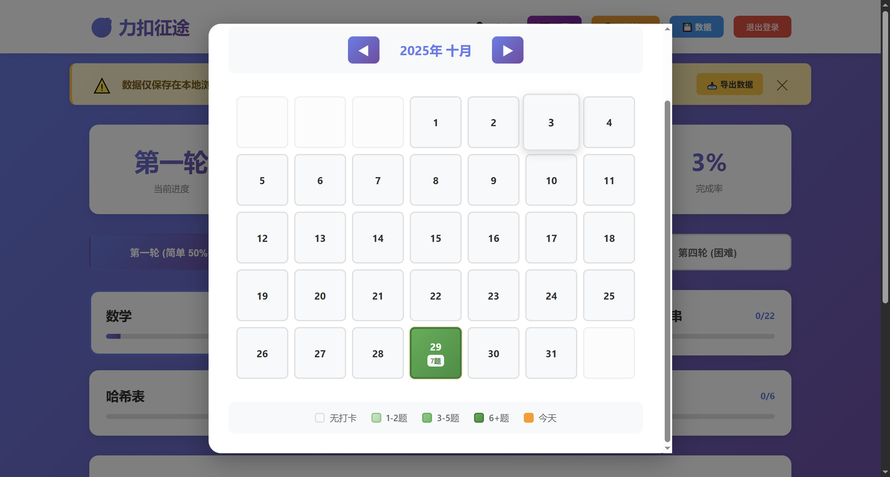
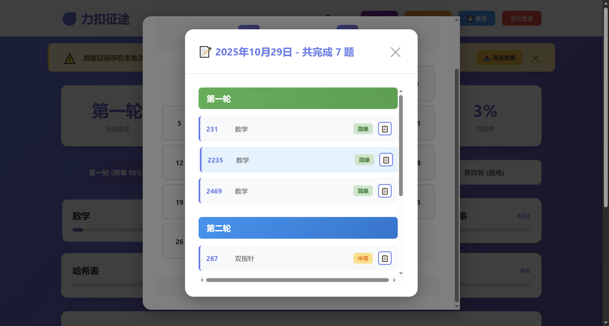

# 🎯 力扣征途 - 四轮进阶算法修炼之路

> 本项目全程使用AI构建，纯HTML，CSS，Javascript项目

一个系统化的LeetCode刷题进度跟踪工具，帮助你循序渐进地完成算法学习，科学地提升编程能力。

## ✨ 项目特色

- 🎯 **四轮进阶体系**：从基础到困难，科学的分级训练
- 📊 **实时进度跟踪**：直观显示完成情况和统计数据
- 📅 **可视化日历**：打卡日历，直观展示刷题热度和详情
- 💾 **数据管理**：支持导出/导入，防止数据丢失
- 💡 **刷题技巧指导**：内置刷题经验和建议
- 👥 **多用户支持**：不同用户数据独立存储
- 🎨 **现代化UI**：渐变紫色主题，响应式设计
- 📋 **快速复制**：一键复制题号，方便查找
- 📝 **题目标题显示**：题目列表和日历详情中显示完整标题

## 📋 功能特点

### ✅ 核心功能

1. **用户登录系统**
   - 支持多用户，数据独立保存
   - 自动记住登录状态

2. **四轮刷题计划**
   - **第一轮**：基础入门（简单题，通过率≥50%）- 137道
   - **第二轮**：进阶提升（中等题，通过率≥50%）- 58道
   - **第三轮**：算法理论（树、图、贪心、动态规划）- 184道
   - **第四轮**：困难挑战（困难题和低通过率题）- 97道

3. **题目分类管理**
   - 9大基础分类：数学、数组、链表、字符串、哈希表、双指针、递归、栈、队列
   - 4大进阶分类：树、图与回溯算法、贪心、动态规划

4. **题目显示**
   - 题目列表显示题号和标题（格式：题号 - 标题）
   - 已完成题目使用紫色渐变背景，标题清晰可读
   - 悬停题目卡片显示复制按钮

5. **打卡功能**
   - 点击题号即可标记完成/取消
   - 动画反馈效果
   - 实时更新进度统计

6. **数据管理**
   - 📥 导出数据为JSON文件
   - 📤 从文件导入恢复数据
   - ⚠️ 数据提醒横幅

7. **刷题技巧指导**
   - 详细的四轮刷题策略
   - 每轮的难度说明和顺序建议
   - 科学的学习路径规划

8. **进度统计**
   - 当前轮次显示
   - 已完成题目数
   - 总题目数
   - 完成率百分比

9. **刷题日历** 📅
   - 弹窗式日历显示
   - 颜色热度图：根据每日刷题数量显示不同颜色
     - 无打卡：浅灰色
     - 1-2题：浅绿色
     - 3-5题：中绿色
     - 6+题：深绿色
   - 点击日期查看详细刷题记录
   - 按轮次分组显示题目信息（包含题号、标题、分类、难度）
   - 支持一键复制题号（仅复制题号，不包含标题）

## 💡 刷题技巧指南

> 建议刷题的时候分成四轮来刷，不用想着第一次就把单个分类的全部刷完。

### 第一轮 - 基础入门 🟢

按照 **数学 > 数组 > 链表 > 字符串 > 哈希表 > 双指针 > 递归 > 栈 > 队列** 的顺序，主要刷：**难度简单，通过率在50%以上的题目**。

### 第二轮 - 进阶提升 🔵

按照 **数学 > 数组 > 链表 > 字符串 > 哈希表 > 双指针 > 递归 > 栈 > 队列** 的顺序，主要刷：**难度中等，通过率在50%以上的题目**。

### 第三轮 - 算法理论 🟠

⚠️ **先不要急着刷题！** 建议找个视频，把相关算法理论看一遍，比如：什么是分治，什么是贪心，什么是动态规划，什么是二叉搜索树，什么是图等概念。

再把 **树 > 图与回溯算法 > 贪心 > 动态规划** 这些刷一遍，刷的时候还是刷**简单或者中等，通过率50%以上的题目**。

### 第四轮 - 困难挑战 🔴

第四轮就比较难了，可以刷剩余困难的，还有以前没刷的，**通过率低于50%的题目**。但是这一轮会非常的难，难以坚持下去。

💪 **坚持就是胜利！**

## 🚀 使用方法

1. 用浏览器打开 `index.html`
2. 输入用户名登录（首次自动创建账号）
3. 点击 💡 刷题技巧 查看详细攻略
4. 选择要刷的轮次
5. 点击分类查看题目
6. 查看题目列表，每个题目显示题号和标题
7. 点击题号进行打卡
8. 悬停题目卡片，点击 📋 按钮快速复制题号
9. 点击 📅 日历 查看刷题日历和历史记录
10. 定期点击 💾 数据 导出备份进度

### 📅 日历功能使用说明

1. **打开日历**
   - 点击顶部导航栏的 📅 日历 按钮（紫色按钮）
   - 日历以弹窗形式展示

2. **查看打卡情况**
   - 日历使用颜色热度图显示每天的刷题数量
   - 颜色越深表示当天刷题越多
   - 今天的日期会用橙色边框高亮

3. **查看详细记录**
   - 点击任意有打卡记录的日期（有颜色的日期）
   - 弹出详情窗口，显示当天完成的所有题目
   - 题目按轮次分组，显示题号、标题、分类、难度
   - 每个题号旁边有 📋 按钮，点击可快速复制题号

4. **切换月份**
   - 使用 ◀ ▶ 按钮浏览不同月份的打卡记录

5. **关闭日历**
   - 点击右上角 ✕ 关闭按钮
   - 或点击弹窗外的灰色区域

## 📂 文件说明

- `index.html` - 主页面结构（登录界面、主界面、弹窗）
- `style.css` - 样式文件（渐变主题、响应式布局）
- `script.js` - 核心功能逻辑（数据管理、UI渲染、进度跟踪）
- `problems-data.json` - 题目数据（458道题的难度、通过率、分类）
- `README.md` - 项目说明文档

## 💾 数据存储

### 存储位置
用户数据存储在**浏览器的 localStorage** 中：

1. **当前用户名**
   - 键名：`leetcodeUser`

2. **用户刷题进度**
   - 键名：`progress_{用户名}`
   - 格式：JSON对象，包含四轮的打卡记录

3. **横幅显示状态**
   - 键名：`noticeHidden`

### 数据结构

```javascript
{
  "round1": {
    "1": { "solvedAt": "2025-10-28T08:00:00.000Z", "round": "round1" },
    "2": { "solvedAt": "2025-10-28T08:05:00.000Z", "round": "round1" }
  },
  "round2": {},
  "round3": {},
  "round4": {}
}
```

### 查看数据

在浏览器开发者工具中：
- **Chrome/Edge**：F12 → Application → Local Storage
- **Firefox**：F12 → Storage → Local Storage

### ⚠️ 注意事项

- 数据仅保存在当前浏览器中
- 清除浏览器缓存会删除所有进度
- **强烈建议定期导出备份数据**

## 🛠️ 技术栈

- **前端**：纯 HTML/CSS/JavaScript
- **存储**：localStorage（本地存储）
- **特性**：
  - 无需后端服务器
  - 响应式CSS布局
  - 现代化动画效果
  - Clipboard API（复制功能）

## 📊 题目数据 

> 题目号来源于网络，难度和通过率来源于AI搜索，会有不准的数据，可以自行增删改。

项目包含 **458道** 精选LeetCode题目：

- 涵盖13个算法分类
- 包含简单、中等、困难三个难度
- 记录每题的通过率数据
- 根据难度和通过率智能分配到四个轮次

## 🎨 界面设计

- **渐变紫色主题**：现代、优雅
- **卡片式布局**：清晰、直观
- **动画效果**：流畅的交互体验
- **响应式设计**：适配手机和电脑
- **Emoji图标**：增强视觉吸引力

## ⭐ 使用建议

1. **循序渐进**：严格按照四轮顺序完成
2. **每日打卡**：养成每天刷题的习惯
3. **定期备份**：每周导出一次数据
4. **理论先行**：第三轮前务必学习算法理论
5. **复习巩固**：定期回顾已完成的题目
6. **记录笔记**：在LeetCode网站上记录解题思路

## 🔮 功能规划

未来可能添加的功能：

- [x] ~~刷题日历可视化~~ ✅ 已完成
- [ ] 题目难度和分类的自定义筛选
- [ ] 学习时长统计
- [ ] 每日打卡提醒
- [ ] 题目笔记功能
- [ ] 错题本功能
- [ ] 复习提醒系统
- [ ] 数据可视化图表
- [ ] 题目标签系统
- [ ] 社交分享功能





## 📧 反馈与建议

如有问题或建议，欢迎提出！


---

**祝你在力扣征途上披荆斩棘，早日掌握算法精髓！** 🎉
